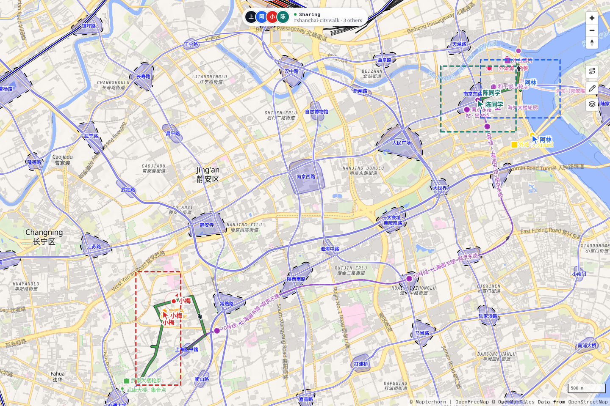
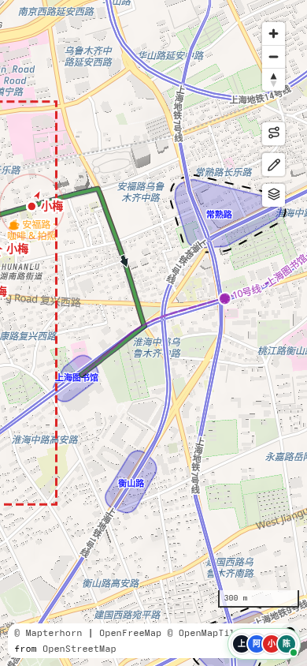
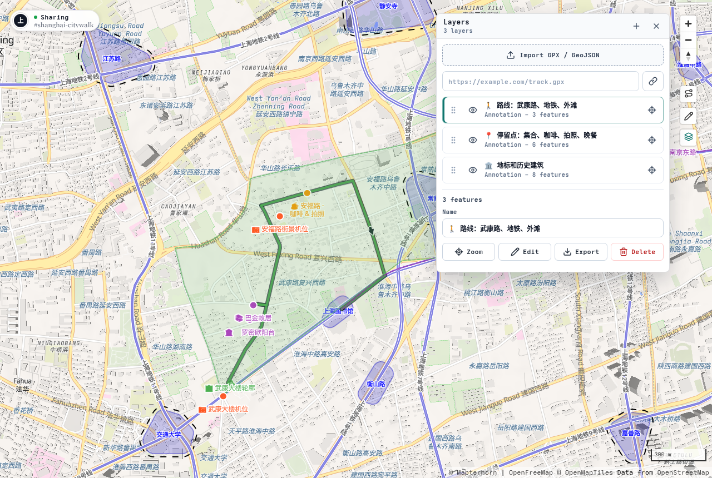
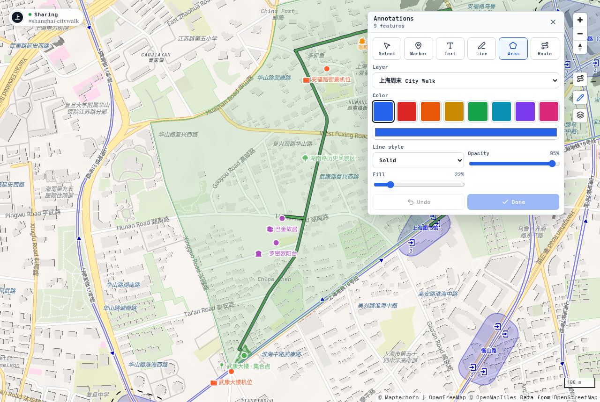
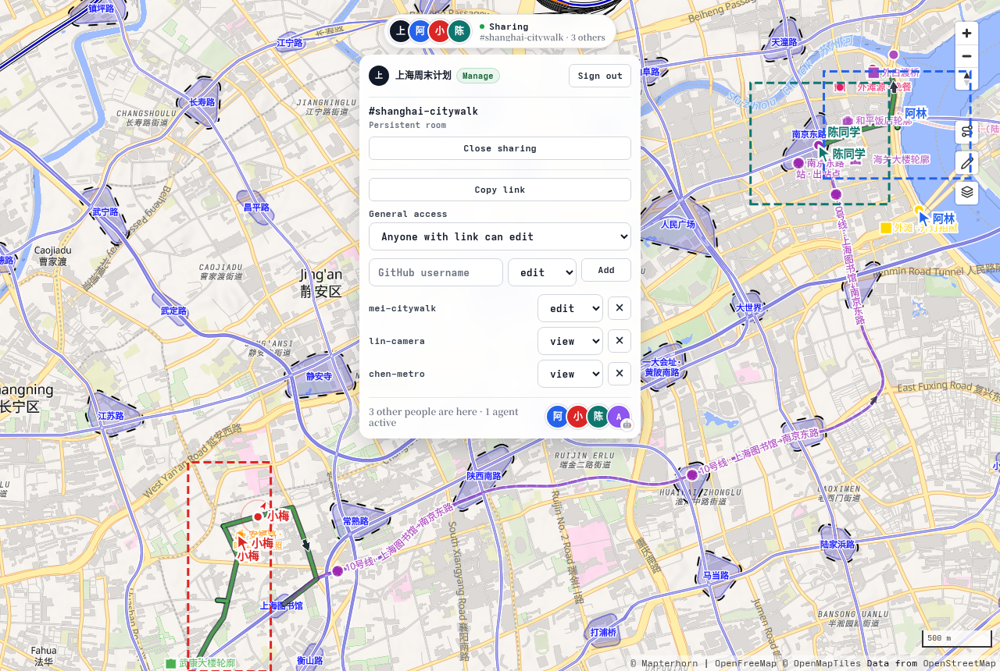

# Map Room Collaboration Demo

一个面向地图协作和空间标注的产品 demo。你可以在浏览器里打开一张地图，导入 GPX / GeoJSON，整理图层，画标注，并把同一个地图房间分享给团队成员或 AI Agent 一起操作。

这个 demo 的重点不是“把地图发给别人看”，而是把地图变成一个可协作的工作空间：人可以实时讨论和标注，Agent 也可以全天候进入同一个房间，读取当前地图状态，自动创建、整理和更新标注。

## 产品截图

下面这组截图围绕一个固定故事：几个人一起规划周六下午的上海 city walk。第一段在武康大楼附近集合，沿武康路走到安福路喝咖啡、拍街景；第二段坐地铁到南京东路 / 延安路一带，去外滩拍照，最后在外滩源吃晚饭。

这个场景来自 `shanghai-citywalk` 房间的真实标注数据，用来展示产品的核心使用模式：大家在同一个地图房间里标地点、整理图层、看彼此光标和视野，把同一份计划同步给桌面端、手机端和 Agent。

你也可以直接打开线上 demo 房间查看这条路线：
[https://map.mgt.moe/?room=shanghai-citywalk#13.8/31.22727/121.44643](https://map.mgt.moe/?room=shanghai-citywalk#13.8/31.22727/121.44643)

<table>
  <tr>
    <td width="72%">
      <strong>桌面端完整行程</strong><br />
      
    </td>
    <td width="28%">
      <strong>移动端现场查看</strong><br />
      
    </td>
  </tr>
</table>

下面的截图分别聚焦这条故事里的一个核心操作。

<table>
  <tr>
    <td width="33%">
      <strong>导入和整理图层</strong><br />
      <span>把步行路线、换乘/拍照/晚餐地点、历史建筑轮廓拆成不同图层，方便开关和复查。</span><br />
      
    </td>
    <td width="33%">
      <strong>和朋友一起标记</strong><br />
      <span>放大武康大楼、罗密欧阳台、巴金故居和安福路，把每个停留点、拍照机位和建筑轮廓标清楚。</span><br />
      
    </td>
    <td width="33%">
      <strong>多人同步查看</strong><br />
      <span>同一个房间里可以看到朋友正在看的区域、指针位置、在线状态和分享权限；Agent 也能进来整理标注。</span><br />
      
    </td>
  </tr>
</table>

## 你可以用它做什么

- 浏览地图，并在地图上查看地点、道路、轨迹和周边要素。
- 导入 GPX / GeoJSON，把外部轨迹、行程方案或调研数据叠加到地图上。
- 管理多个图层，控制显示、排序、样式、缩放和导出。
- 绘制点、文本、线、区域和路线标注，作为行程说明、协作讨论或现场记录。
- 开一个协作房间，让多个人实时看到彼此的视野、光标、图层和标注变化。
- 通过 GitHub 登录管理房间权限，支持链接访问、指定用户授权和房间持久化。
- 让 Agent 进入房间，读取地图状态，自动添加地点、路线、区域和说明文字。
- 把 Agent 当作全天候地图助手，用来持续整理资料、补充标注和维护共享地图。

## 直接试用

打开这个线上 demo 房间即可查看完整的上海 city walk 场景：

[https://map.mgt.moe/?room=shanghai-citywalk#13.8/31.22727/121.44643](https://map.mgt.moe/?room=shanghai-citywalk#13.8/31.22727/121.44643)

你也可以改 URL 里的 `room` 参数来创建或打开另一个协作房间。同一个 `room` 参数代表同一个共享地图：

```text
https://map.mgt.moe/?room=your-room-id
```

## 基本使用方式

### 打开一个地图房间

直接访问 `/?room=your-room-id`。同一个房间里的浏览器和 Agent 会同步图层、标注、在线状态、视野和光标。

访客也能快速试用。登录 GitHub 后，可以把房间认领为持久房间，并管理分享权限。

### 导入和整理图层

在右侧工具栏打开 Layers 面板，可以：

- 拖入 GPX / GeoJSON 文件。
- 从 URL 导入外部 GPX / GeoJSON。
- 重命名、隐藏、排序、缩放到图层。
- 调整图层颜色、透明度和线宽。
- 导出图层数据。

### 在地图上做标注

打开 Annotations 面板，可以添加：

- Marker：点位标记。
- Text：地图文字说明。
- Line：自由路径。
- Area：区域范围。
- Route：带路线信息的路径标注。

标注会作为房间状态同步，适合讨论行程方案、现场点位、资料整理和问题记录。

### 分享给团队和 Agent

协作面板里可以管理房间访问方式：

- `restricted`：只有房主或显式授权用户能访问。
- `view`：有链接的人可以查看。
- `edit`：有链接的人可以编辑。

登录用户可以给 GitHub 用户单独授权 `view`、`edit` 或 `manage`。Agent 也可以作为房间参与者加入，和人类用户操作同一份地图状态。

### 让 Agent 进房间工作

Agent 是这个 demo 的核心特色之一。安装 skill 后，你可以直接把房间链接交给 Agent，让它进入房间读取当前地图、检查已有图层和标注，并按你的描述自动补充点位、路线、区域和说明。它不只是一次性生成内容，也可以作为长期在线的地图助手，持续维护同一个共享房间。

适合交给 Agent 的任务包括：

- 根据一段文字行程自动创建地点和路线标注。
- 把一组调研点整理成不同图层。
- 检查地图里缺少说明的点位，并补充备注。
- 全天候维护同一个共享房间，持续整理新的资料和标注。

Agent skill 可以用 `npx skills add` 安装到 Codex：

```bash
npx skills add Enter-tainer/orm-pmtiles-demo --skill agent-room --agent codex --global --yes --full-depth
```

如果是在本仓库里本地开发这个 skill，也可以直接从本地路径安装：

```bash
npx skills add . --skill agent-room --agent codex --global --yes --full-depth
```

Skill 文档在 [packages/agent-room-cli/skills/agent-room/SKILL.md](packages/agent-room-cli/skills/agent-room/SKILL.md)。

## 项目结构

```text
src/
  main.ts                    # 浏览器地图入口
  worker.ts                  # Cloudflare Worker 和协作 Durable Object
  collaboration.ts           # 浏览器协作 UI 和 WebSocket 同步
  layer-*                    # 图层模型、存储、同步和 UI
  annotation-*               # 标注模型、工具和渲染
  account-* / room-*         # 登录、房间和权限 API

packages/agent-room-cli/     # Agent Room CLI 和 Agent skill
migrations/                  # D1 数据库迁移
scripts/styles/              # OpenRailwayMap 样式生成脚本
docs/                        # 设计文档和产品截图
```

更深入的实现说明在：

- [docs/account-room-permissions-design.md](docs/account-room-permissions-design.md)
- [docs/layer-stack-design.md](docs/layer-stack-design.md)

## 数据和许可

仓库包含应用代码、样式资源和 demo 截图，不包含完整的 OpenRailwayMap / OpenStreetMap 数据归档。公开部署时，请确认你的 PMTiles 数据来源、更新频率、服务限制和 attribution 展示符合对应数据许可。

代码许可证见 [LICENSE](LICENSE)。

## 项目状态

这个仓库目前以产品 demo 和试用为主，还不把外部 PR 作为主要协作方式。如果你在本地改动房间状态、权限、WebSocket 协议、图层存储或 Agent CLI，建议在提交前运行：

```bash
pnpm fmt:check
pnpm lint
pnpm typecheck
pnpm test:all
```
