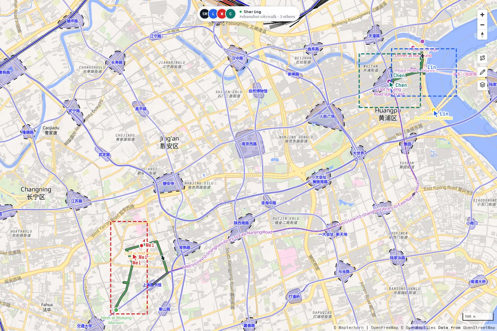
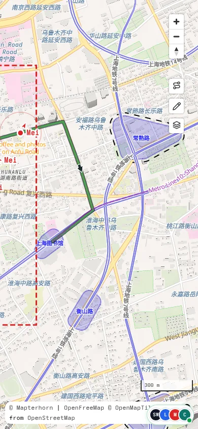
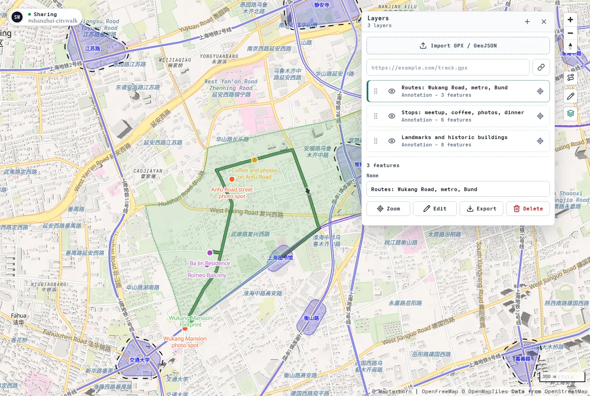
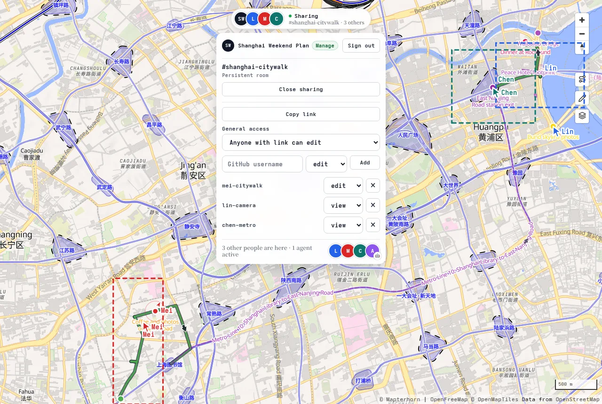

# Atlas Realm

**Draw, tag, and decide — on a map where agent is your teammate.**

[中文 README](README.zh-CN.md)

Atlas Realm turns a map into a shared document. People can import tracks, organize layers, draw annotations, manage room access, and keep everyone on the same spatial context. Agents can join the same room as collaborators: reading the current map state, inspecting layers and annotations, and adding or maintaining spatial context over time.

The original idea was Google Docs on top of a map. The useful extension is that the document is not only for people. It is structured enough for agents to read, edit, and keep in sync.

## Install The Skill

Install the Atlas Realm skill for Codex:

```bash
npx skills add Enter-tainer/atlas-realm --skill atlas-realm --agent codex --global --yes --full-depth
```

Then give an agent a room URL such as `https://map.mgt.moe/?room=your-room-id` and ask it to inspect layers, add annotations, or maintain the shared map context.

Useful companion skills:

- [AMap LBS Skill](https://github.com/AMap-Web/amap-lbs-skill): China-focused POI search, route planning, travel planning, nearby search, and map visualization. It uses AMap Web Service APIs, so configure an AMap Web Service Key before using it.
- [Norikae Guide Skill](https://github.com/Enter-tainer/norikae-guide-skill): Japan transit planning with Yahoo! 乗換案内, including station-name normalization, live route-page fetching, and route extraction.
- [Hermes Maps Skill](https://github.com/NousResearch/hermes-agent/blob/main/skills/productivity/maps/SKILL.md): OpenStreetMap/OSRM-based geocoding, reverse geocoding, nearby POI search, travel distance, directions, timezone lookup, and bounding-box search without an API key.

## Screenshots

This screenshot set follows a fixed Shanghai city walk story. The group meets near Wukang Mansion, walks through Wukang Road and Anfu Road, takes the metro toward East Nanjing Road, photographs the Bund, and finishes with dinner at Rockbund.

The scene is based on annotation data from the `shanghai-citywalk` room and demonstrates the core workflow: shared map rooms, layer organization, annotation editing, peer cursors, viewport awareness, sharing controls, and agent presence.

Open the live demo room:
[https://map.mgt.moe/?room=shanghai-citywalk#13.8/31.22727/121.44643](https://map.mgt.moe/?room=shanghai-citywalk#13.8/31.22727/121.44643)

<table>
  <tr>
    <td width="72%">
      <strong>Desktop planning view</strong><br />
      
    </td>
    <td width="28%">
      <strong>Mobile field view</strong><br />
      
    </td>
  </tr>
</table>

Focused workflow captures:

<table>
  <tr>
    <td width="33%">
      <strong>Layer organization</strong><br />
      <span>Separate walking routes, transit, photo stops, dinner plans, and landmark footprints into reviewable layers.</span><br />
      
    </td>
    <td width="33%">
      <strong>Shared annotation</strong><br />
      <span>Mark stops, photo angles, routes, and historic building outlines directly on the shared map document.</span><br />
      
    </td>
    <td width="33%">
      <strong>Room sharing</strong><br />
      <span>See collaborators, viewports, cursors, room access, grants, and an active agent in the same room.</span><br />
      
    </td>
  </tr>
</table>

## What It Does

- Browse a live map backed by OpenRailwayMap/OpenStreetMap-style vector data.
- Import GPX and GeoJSON files or URLs into room layers.
- Manage layer order, visibility, names, styles, zoom-to-layer, and exports.
- Draw shared markers, text notes, lines, areas, and route annotations.
- Open a room where browsers and agents synchronize layers, annotations, cursors, viewports, and presence.
- Use GitHub login to claim persistent rooms and manage link access or per-user grants.
- Let agents enter a room, inspect the current spatial document, and add or update annotations.
- Treat agents as long-running map collaborators that can keep spatial context organized.

## Try It

Open the Shanghai city walk demo:

[https://map.mgt.moe/?room=shanghai-citywalk#13.8/31.22727/121.44643](https://map.mgt.moe/?room=shanghai-citywalk#13.8/31.22727/121.44643)

You can also change the `room` query parameter to create or open another shared map room:

```text
https://map.mgt.moe/?room=your-room-id
```

## Basic Workflow

### Open a Map Room

Visit `/?room=your-room-id`. Every browser and agent connected to the same room receives synchronized layers, annotations, presence, viewport outlines, and cursor state.

Guests can try a room immediately. After signing in with GitHub, a user can claim a room, make it persistent, and manage sharing.

### Import and Organize Layers

Open the Layers panel from the map toolbar to:

- Drop GPX or GeoJSON files onto the map.
- Import GPX or GeoJSON from URLs.
- Rename, hide, reorder, zoom to, and export layers.
- Adjust layer color, opacity, and line width.

### Annotate the Map

Open the Annotations panel to create:

- Marker annotations for places.
- Text annotations for map labels and notes.
- Line annotations for freeform paths.
- Area annotations for polygons.
- Route annotations with path metadata.

Annotations are stored as room state and synchronized to collaborators, which makes them useful for planning, field work, investigation notes, and agent-maintained spatial context.

### Share With People and Agents

The collaboration panel manages room access:

- `restricted`: only the owner or explicitly granted users can access the room.
- `view`: anyone with the link can view.
- `edit`: anyone with the link can edit.

Signed-in users can grant GitHub users `view`, `edit`, or `manage` access. Agents join as room participants and operate on the same layers and annotations as human collaborators.

### Bring an Agent Into the Room

The Atlas Realm skill lets Codex connect to a room, read the current map state, inspect layer contents, and add points, routes, areas, or notes. The agent can work from a room URL instead of a detached prompt, so it has shared spatial context and can leave its changes in the same document.

Useful agent tasks include:

- Turn a written trip plan into route and place annotations.
- Organize a set of research points into separate layers.
- Review missing notes or unnamed features and fill them in.
- Keep a shared room maintained as new material arrives.

For local development from this repository:

```bash
npx skills add . --skill atlas-realm --agent codex --global --yes --full-depth
```

Skill documentation lives in [packages/atlas-realm-cli/skills/atlas-realm/SKILL.md](packages/atlas-realm-cli/skills/atlas-realm/SKILL.md).

## Project Structure

```text
src/
  main.ts                    # Browser map entrypoint
  worker.ts                  # Cloudflare Worker and collaboration Durable Object
  collaboration.ts           # Browser collaboration UI and WebSocket sync
  layer-*                    # Layer model, storage, sync, and UI
  annotation-*               # Annotation model, tools, and renderer
  account-* / room-*         # Login, room, and permission APIs

packages/atlas-realm-cli/     # Atlas Realm CLI and Codex skill
migrations/                  # D1 database migrations
scripts/styles/              # OpenRailwayMap style generation scripts
scripts/                     # Automation and style tooling
docs/                        # Design notes and product screenshots
```

Design notes:

- [docs/account-room-permissions-design.md](docs/account-room-permissions-design.md)
- [docs/layer-stack-design.md](docs/layer-stack-design.md)

## Data and License

This repository contains application code, style assets, and demo screenshots. It does not contain full OpenRailwayMap/OpenStreetMap data archives. Public deployments should verify PMTiles data source, update cadence, service limits, and attribution requirements.

Code license: [LICENSE](LICENSE).

## Project Status

Atlas Realm is currently a product demo and experimental workspace for collaborative spatial documents. Before committing changes to room state, permissions, the WebSocket protocol, layer storage, annotation handling, or the Atlas Realm CLI, run:

```bash
pnpm fmt:check
pnpm lint
pnpm typecheck
pnpm test:all
```
