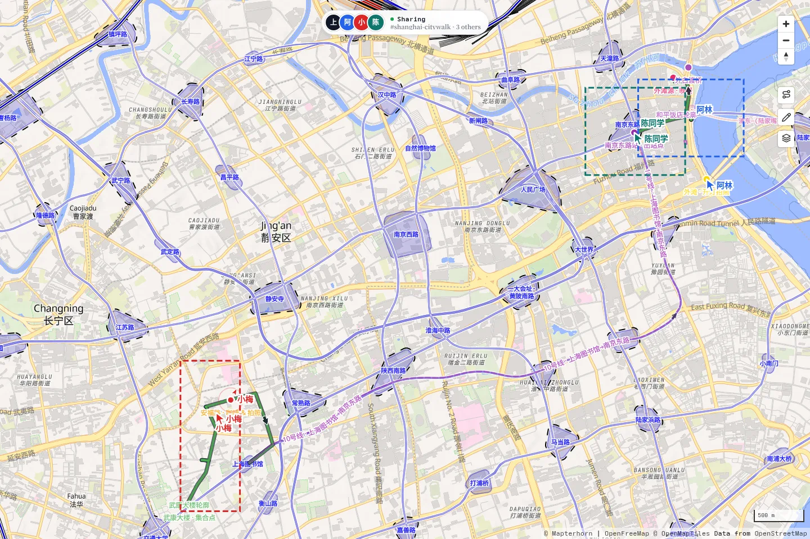
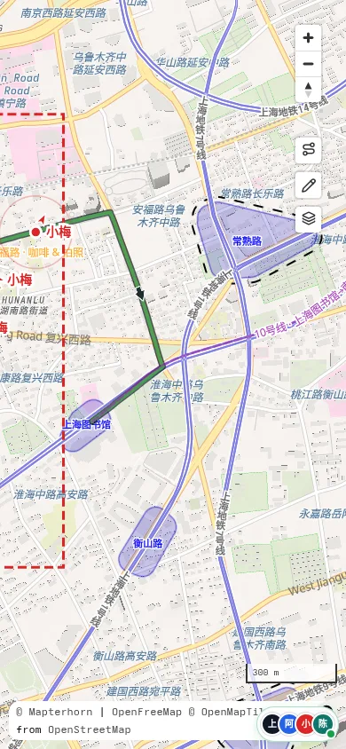
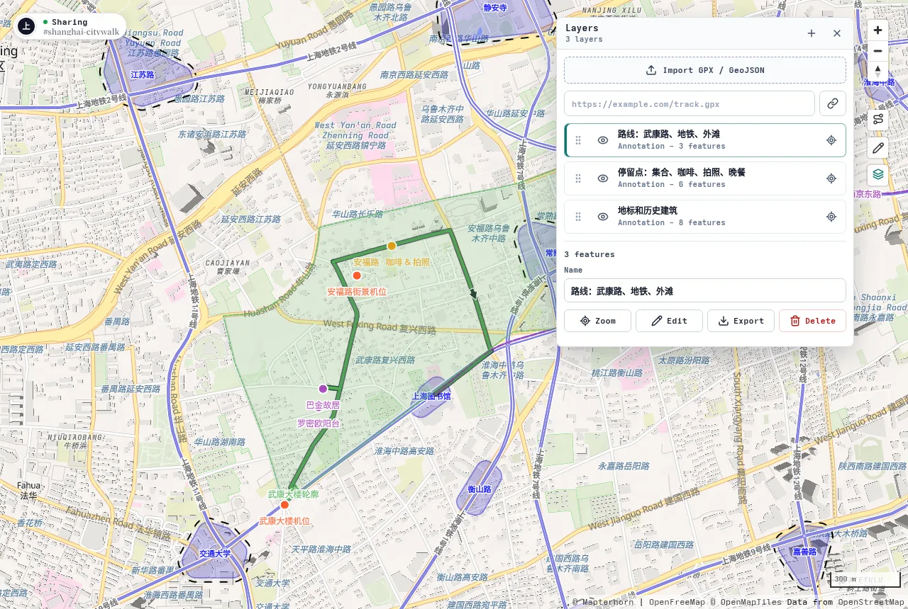
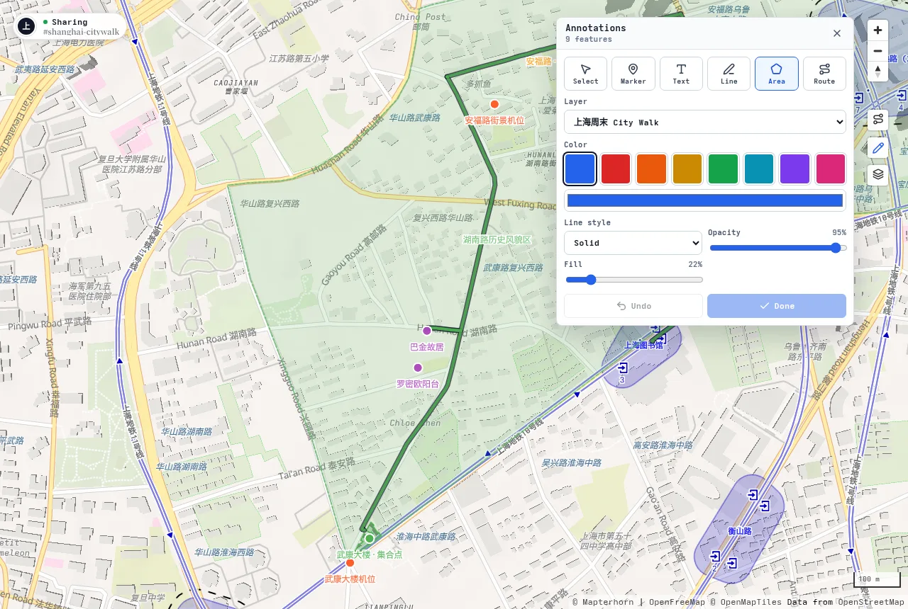
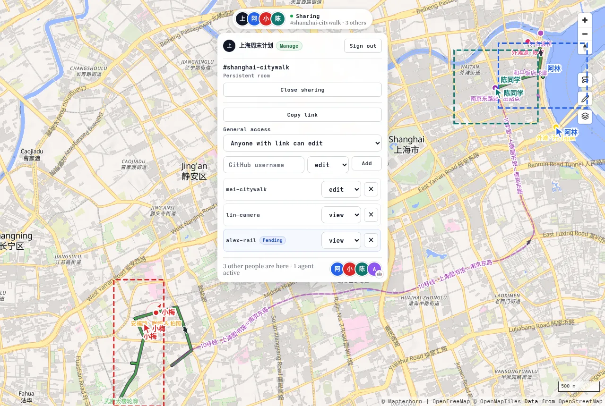

# Atlas Realm

**Draw, tag, and decide — on a map where agent is your teammate.**

[English README](README.md)

Atlas Realm 把地图变成共享文档。人可以在同一个房间里导入轨迹、整理图层、绘制标注、管理访问权限，并保持同一份空间上下文同步；Agent 也可以作为协作者进入房间，读取当前地图状态、检查图层和标注，并持续补充或维护空间信息。

最开始的想法是做地图上的 Google Docs。现在更准确的定位是：这份空间文档不仅给人用，也要足够结构化，让 Agent 可以读取、编辑和同步。

## 安装 Skill

Atlas Realm skill 可以用 `npx skills add` 安装到 Codex：

```bash
npx skills add Enter-tainer/atlas-realm --skill atlas-realm --agent codex --global --yes --full-depth
```

安装后，把 `https://map.mgt.moe/?room=your-room-id` 这样的房间 URL 交给 Agent，就可以让它检查图层、添加标注，或维护同一份共享地图上下文。

也可以搭配这些有用的 skill：

- [AMap LBS Skill](https://github.com/AMap-Web/amap-lbs-skill)：面向中国地图场景的 POI 搜索、路径规划、旅游规划、周边搜索和地图可视化。它使用高德 Web Service API，使用前需要配置高德 Web Service Key。
- [Norikae Guide Skill](https://github.com/Enter-tainer/norikae-guide-skill)：面向日本公共交通换乘规划，基于 Yahoo! 乗換案内，支持站名规范化、实时结果页抓取和路线内容提取。
- [Hermes Maps Skill](https://github.com/NousResearch/hermes-agent/blob/main/skills/productivity/maps/SKILL.md)：基于 OpenStreetMap / OSRM 的地理编码、反向地理编码、周边 POI、距离、导航、时区和 bounding box 查询，不需要 API key。

## 产品截图

下面这组截图围绕一个固定故事：几个人一起规划周六下午的上海 city walk。第一段在武康大楼附近集合，沿武康路走到安福路喝咖啡、拍街景；第二段坐地铁到南京东路一带，去外滩拍照，最后在外滩源吃晚饭。

这个场景来自 `shanghai-citywalk` 房间的标注数据，用来展示 Atlas Realm 的核心使用模式：共享地图房间、图层整理、标注编辑、协作者光标、视野同步、分享权限，以及 Agent 在线状态。

你也可以直接打开线上 demo 房间查看这条路线：
[https://map.mgt.moe/?room=shanghai-citywalk#13.8/31.22727/121.44643](https://map.mgt.moe/?room=shanghai-citywalk#13.8/31.22727/121.44643)

<table>
  <tr>
    <td width="72%">
      <strong>桌面端规划视图</strong><br />
      
    </td>
    <td width="28%">
      <strong>移动端现场查看</strong><br />
      
    </td>
  </tr>
</table>

下面的截图分别聚焦这条故事里的一个核心操作。

<table>
  <tr>
    <td width="33%">
      <strong>整理图层</strong><br />
      <span>把步行路线、地铁换场、拍照点、晚餐安排和历史建筑轮廓拆成不同图层，方便开关和复查。</span><br />
      
    </td>
    <td width="33%">
      <strong>共享标注</strong><br />
      <span>把停留点、拍照机位、步行路线和建筑轮廓直接标在同一份共享地图文档上。</span><br />
      
    </td>
    <td width="33%">
      <strong>房间分享</strong><br />
      <span>同一个房间里可以看到协作者、视野、光标、分享权限、授权列表和在线 Agent。</span><br />
      
    </td>
  </tr>
</table>

## 你可以用它做什么

- 浏览地图，并查看地点、道路、轨迹和周边要素。
- 导入 GPX / GeoJSON 文件或 URL，把外部轨迹、行程方案或调研数据叠加到地图上。
- 管理多个图层，控制显示、排序、样式、缩放和导出。
- 绘制点、文本、线、区域和路线标注。
- 开一个协作房间，让浏览器和 Agent 同步图层、标注、在线状态、视野和光标。
- 通过 GitHub 登录认领持久房间，并管理链接访问和指定用户授权。
- 让 Agent 进入房间，读取当前空间文档，自动添加地点、路线、区域和说明文字。
- 把 Agent 当作长期在线的地图协作者，持续整理和维护空间上下文。

## 直接试用

打开这个线上 demo 房间即可查看完整的上海 city walk 场景：

[https://map.mgt.moe/?room=shanghai-citywalk#13.8/31.22727/121.44643](https://map.mgt.moe/?room=shanghai-citywalk#13.8/31.22727/121.44643)

你也可以改 URL 里的 `room` 参数来创建或打开另一个协作房间。同一个 `room` 参数代表同一个共享地图：

```text
https://map.mgt.moe/?room=your-room-id
```

## 基本使用方式

### 打开一个地图房间

直接访问 `/?room=your-room-id`。同一个房间里的浏览器和 Agent 会同步图层、标注、在线状态、视野范围和光标。

访客可以快速试用。登录 GitHub 后，可以把房间认领为持久房间，并管理分享权限。

### 导入和整理图层

在地图工具栏打开 Layers 面板，可以：

- 拖入 GPX / GeoJSON 文件。
- 从 URL 导入外部 GPX / GeoJSON。
- 重命名、隐藏、排序、缩放到图层。
- 调整图层颜色、透明度和线宽。
- 导出图层数据。

### 在地图上做标注

打开 Annotations 面板，可以添加：

- Marker：点位标记。
- Text：地图文字说明。
- Line：自由路径。
- Area：区域范围。
- Route：带路线信息的路径标注。

标注会作为房间状态同步，适合讨论行程方案、现场点位、调研资料和 Agent 维护的空间上下文。

### 分享给人和 Agent

协作面板里可以管理房间访问方式：

- `restricted`：只有房主或显式授权用户能访问。
- `view`：有链接的人可以查看。
- `edit`：有链接的人可以编辑。

登录用户可以给 GitHub 用户单独授权 `view`、`edit` 或 `manage`。Agent 也可以作为房间参与者加入，和人类协作者操作同一份图层和标注。

### 让 Agent 进房间工作

Atlas Realm skill 可以让 Codex 连接到一个房间，读取当前地图状态、检查图层内容，并添加点、路线、区域或说明。Agent 拿到的是房间 URL，而不是一段脱离上下文的 prompt，所以它能在同一份空间文档里留下可见、可继续编辑的结果。

适合交给 Agent 的任务包括：

- 根据一段文字行程自动创建地点和路线标注。
- 把一组调研点整理成不同图层。
- 检查地图里缺少说明或名称的要素，并补充备注。
- 在新资料到来时持续维护同一个共享房间。

如果是在本仓库里本地开发这个 skill，也可以直接从本地路径安装：

```bash
npx skills add . --skill atlas-realm --agent codex --global --yes --full-depth
```

Skill 文档在 [packages/atlas-realm-cli/skills/atlas-realm/SKILL.md](packages/atlas-realm-cli/skills/atlas-realm/SKILL.md)。

## 项目结构

```text
src/
  main.ts                    # 浏览器地图入口
  worker.ts                  # Cloudflare Worker 和协作 Durable Object
  collaboration.ts           # 浏览器协作 UI 和 WebSocket 同步
  layer-*                    # 图层模型、存储、同步和 UI
  annotation-*               # 标注模型、工具和渲染
  account-* / room-*         # 登录、房间和权限 API

packages/atlas-realm-cli/     # Atlas Realm CLI 和 Codex skill
migrations/                  # D1 数据库迁移
scripts/styles/              # OpenRailwayMap 样式生成脚本
scripts/                     # 自动化和样式工具
docs/                        # 设计文档和产品截图
```

更深入的实现说明在：

- [docs/account-room-permissions-design.md](docs/account-room-permissions-design.md)
- [docs/layer-stack-design.md](docs/layer-stack-design.md)

## 数据和许可

仓库包含应用代码、样式资源和 demo 截图，不包含完整的 OpenRailwayMap / OpenStreetMap 数据归档。公开部署时，请确认 PMTiles 数据来源、更新频率、服务限制和 attribution 展示符合对应数据许可。

代码许可证见 [LICENSE](LICENSE)。

## 项目状态

Atlas Realm 目前是产品 demo，也是协作式空间文档的实验工作区。如果你在本地改动房间状态、权限、WebSocket 协议、图层存储、标注逻辑或 Atlas Realm CLI，建议在提交前运行：

```bash
pnpm fmt:check
pnpm lint
pnpm typecheck
pnpm test:all
```
